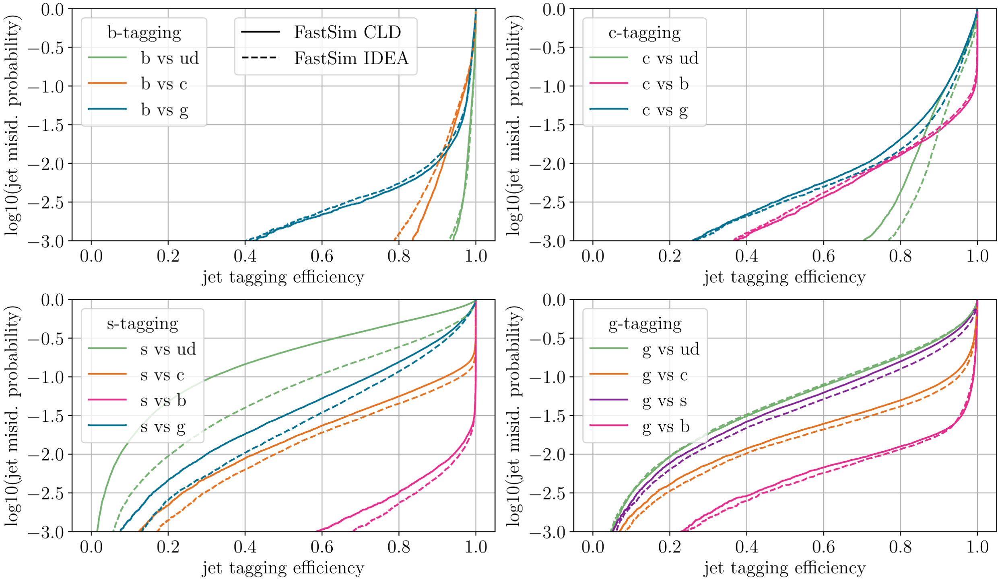

# Jet-Flavor tagging at FCC-ee

The work is published on the [CERN Document Server](https://repository.cern/records/4pcr6-r0d06) and used for the FCC feasibility study.

This repo hosts the plotting for evaluating jet flavor tagging at FCC-ee.



:eyes: Sneak peak: ROC curves comparing CLD and IDEA fast simulation tagging performance. What do we learn? PID information from IDEA is crucial for $s$-tagging. The closer the curves to the lower right corner, the better the performance. 

## Overview of this repository

- Plots for the Technical Note are produced in `all_plots_for_FCCnote.ipynb` and saved in `plots-for-FCC-note`.
- The comparison of jet constituent observables in fast vs. full simulation or $H\rightarrow x \bar{x}$ is in `jet-const-observables_comparison`. 
- The results of the tagging performances are in `roc_curves`.
- The problem of track-cluster matching in pandora is discussed in `check_track-cluster-matching`.
- `track-params-check` compares the helix track parameters in full and fast simulation. 
- We save plots in `saved_plots`.
- `plots_from-key4hep` shows you that the key4hep implementation of the tagger works.  


## Citation

If you use any of these results in your research, please cite:

```
@manual{aumiller_2024_4pcr6-r0d06,
  title        = {Jet Flavor Tagging Performance at FCC-ee},
  author       = {Aumiller, Sara and
                  Garcia, Dolores and
                  Selvaggi, Michele},
  month        = nov,
  year         = 2024,
  doi          = {10.17181/4pcr6-r0d06},
  url          = {https://doi.org/10.17181/4pcr6-r0d06}
}
```
